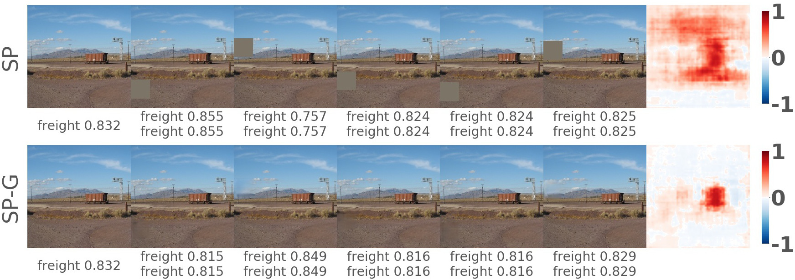
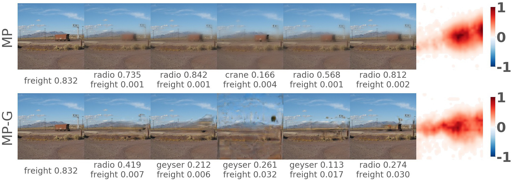

## Removing input features via a generative model to explain their attributions to classifier's decisions

This repository contains source code necessary to reproduce some of the main results in the paper:

**If you use this software in an academic article, please consider citing:**
    
    @article{agarwal2019removing,
        title={Removing input features via a generative model to explain their attributions to classifier's decisions},
        author={Agarwal, Chirag and Schonfeld, Dan and Nguyen, Anh},
        journal={arXiv preprint arXiv:2879044},
        year={2019}
    }
    
## 1. Setup

### Installing software
This code is built using PyTorch. You can install the necessary libraries by pip installing the requirements text file `pip install -r ./requirements.txt`

**Note:** We ran our codes using tensorflow_gpu-1.12.0 with CUDA 9.0. Add the following lines in your ~/.bashrc file if you get "ImportError: libcublas.so.9.0: cannot open shared object file: No such file or directory" on running the code.

`export PATH=/usr/local/cuda-9.0/bin${PATH:+:${PATH}}`

`export LD_LIBRARY_PATH=/usr/local/cuda/lib64:${LD_LIBRARY_PATH:+:${LD_LIBRARY_PATH}}`

## 2. Usage
The main scripts for SP/SP-G, LIME/LIME-G, and MP/MP-G are in [formal_SP_single_image.py](formal_SP_single_image.py), [formal_LIME_single_image.py](formal_LIME_single_image.py), and [formal_MP_single_image.py](formal_MP_single_image.py). In addition, after installing the LIME library you will have to replace the *lime_image.py* script with our [lime_image.py](lime_image.py). Three shell scripts have been provided which for a given an [image](teaser_image.JPEG) and target class generates its respective attribution maps for an algorithm and its generative version.

### Examples

[SP_test.sh](SP_test.sh): 
Generating the attribution map for the class "freight car" using SP and SP-G algorithm.
* Running `source SP_test.sh` produces this result:

    

<i>(left-->right) The real image followed by five random intermediate perturbed images and the resultant attribution map for SP (top) and SP-G (bottom). For each intermediate perturbed image, the top and bottom row labels shows the target and top-1 class predictions with their respective probabilities.</i>

[LIME_test.sh](LIME_test.sh): 
Generating the attribution map for the class "kuvasz" using LIME and LIME-G algorithm.
* Running `source LIME_test.sh` produces this result:

    

<i>(left-->right) The real image followed by five random intermediate perturbed images and the resultant attribution map for LIME (top) and LIME-G (bottom). For each intermediate perturbed image, the top and bottom row labels shows the target and top-1 class predictions with their respective probabilities.</i>

[MP_test.sh](MP_test.sh): 
Generating the attribution map for the class "freight car" using MP and MP-G algorithm.
* Running `source MP_test.sh` produces this result:

     

<i>(left-->right) The real image followed by five random intermediate perturbed images and the resultant attribution map for MP (top) and MP-G (bottom). For each intermediate perturbed image, the top and bottom row labels shows the target and top-1 class predictions with their respective probabilities.</i>

## 4. Licenses
Note that the code in this repository is licensed under MIT License, but, the pre-trained condition models used by the code have their own licenses. Please carefully check them before use. 

## 5. Questions?
If you have questions/suggestions, please feel free to [email](mailto:chiragagarwall12@gmail.com) or create github issues.
